# Zabbix SNMP Data Engineering

> **Understanding, validating, transforming, and structuring Zabbix SNMP telemetry into ML-ready network features.**

This repository documents a data-engineering pipeline built around **Zabbix telemetry**. The emphasis is not on immediately training a model, but on understanding how Zabbix data is structured, how its entities relate to one another, what each metric means, how the metrics behave over time, how data quality is validated, and how observations are transformed into feature vectors suitable for machine learning.

The documentation follows a **data-discovery perspective**:

```text
Host
  ↓
Interface
  ↓
Item
  ↓
Metric
  ↓
History
  ↓
Semantic Meaning
  ↓
Transformation
  ↓
Feature
  ↓
ML Dataset
```

---

## 1. Overview

The pipeline can be viewed as a progressive reduction of complexity:

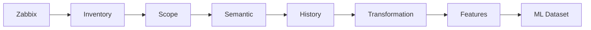

The core questions are:

```text
What devices do we monitor?
        ↓
What metrics do those devices expose?
        ↓
Which metrics are relevant?
        ↓
What does each metric mean?
        ↓
How does each metric behave over time?
        ↓
How do metrics relate to the same interface/device?
        ↓
Can the data be trusted?
        ↓
How can the observations become features?
```

---

## 2. Data Discovery

The first layer describes the monitoring inventory.

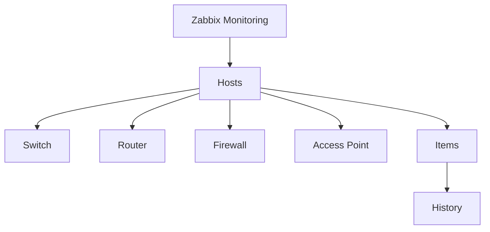

Primary artifacts:

```text
zabbix_script.py
zabbix_summarize.py
zabbix_inventory.json
ai_noc_metrics.json
```

The purpose of this stage is to understand **who is being monitored before understanding what is being measured**.

---

## 3. Data Structure

Zabbix telemetry is not simply a collection of isolated values.

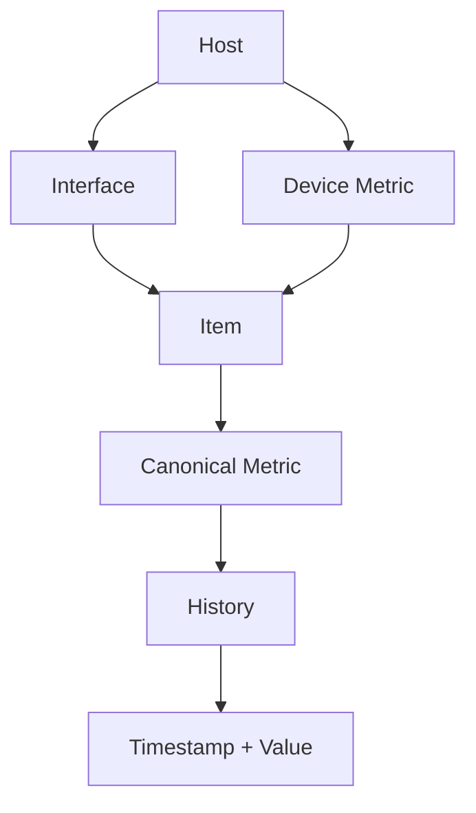

A simplified hierarchy is:

```text
Host
├── Interface
│   ├── Item
│   ├── Item
│   └── Item
│
└── Device Metrics
    ├── CPU
    ├── Memory
    ├── Temperature
    └── Availability
```

This relationship is essential because the final ML observation is usually **not an individual Zabbix item**. Multiple items are later combined into an interface-level or device-level feature vector.

---

## 4. Data Relationships

### Entity relationship

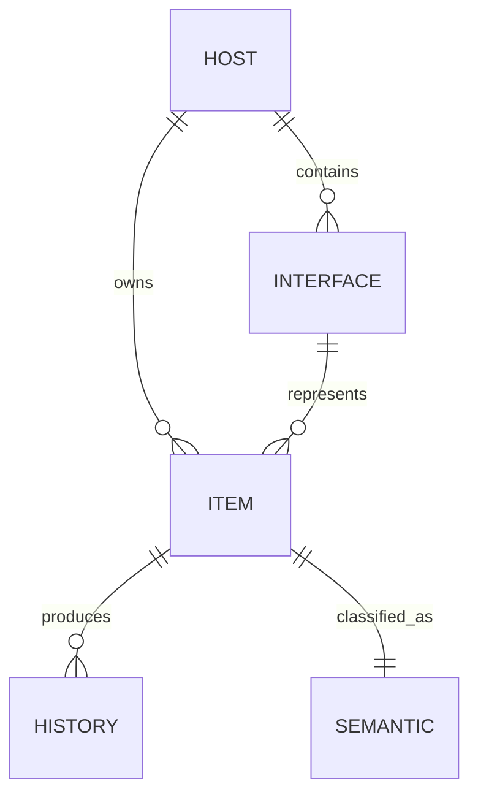

### Identity model

```text
Device
  = hostid

Interface
  = hostid + ifIndex

Item
  = itemid

Observation
  = itemid + timestamp
```

Example:

```text
OPENSTACK-CORE-01
└── ifIndex 34
    ├── in_bps
    ├── out_bps
    ├── in_error_rate
    ├── out_error_rate
    ├── in_discard_rate
    ├── out_discard_rate
    └── oper_status
```

The important discovery is that:

> **One interface is represented by many related metrics.**

---

## 5. Scope

Not every Zabbix item is intended for the AI-NOC dataset.

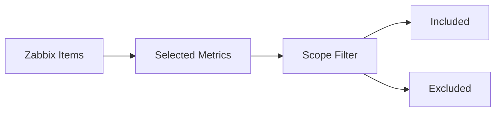

Artifacts:

```text
generate_scope_config.py
scope_filter.py
scope_config.json
selected_metrics.json
scoped_metrics.json
excluded_metrics.json
scope_filter_audit.json
```

Scope establishes the boundary of the data that continues into the engineering pipeline.

```text
Zabbix Inventory
      ↓
Selection
      ↓
Scope Policy
      ↓
Scoped Metrics
```

---

## 6. Semantic Understanding

After selecting the data, the next question is:

> **What kind of number is this?**

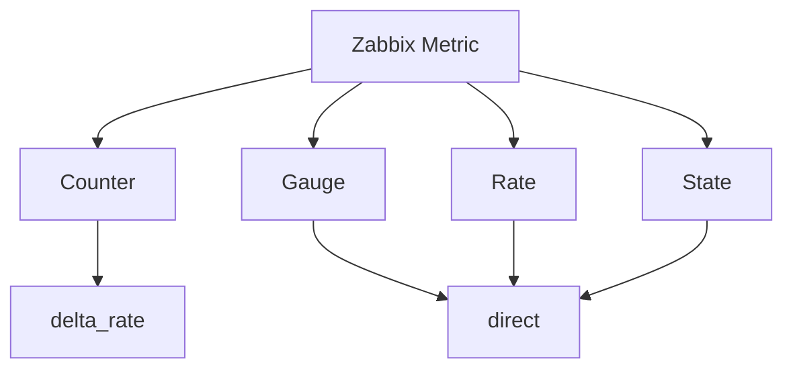

Artifacts:

```text
build_semantic_metrics.py
semantic_metrics.json
audit_semantics.py
semantic_audit.json
```

Typical semantic examples:

```text
CPU
  ↓
Gauge
  ↓
direct

ifHCInOctets
  ↓
Counter
  ↓
delta_rate

oper_status
  ↓
State
  ↓
direct
```

The purpose is to prevent the pipeline from treating fundamentally different measurements as though they were identical.

---

## 7. Canonical Metrics

Different Zabbix items may represent the same operational concept.

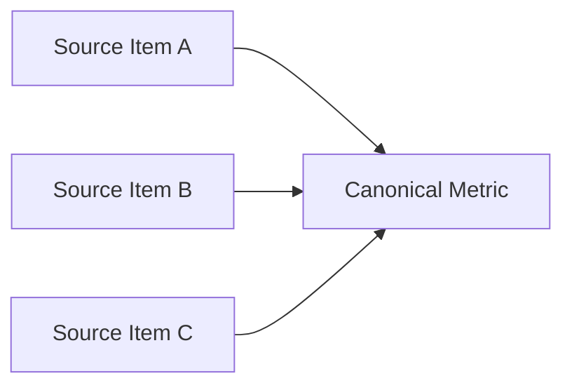

Examples of the canonical vocabulary include:

```text
in_bps
out_bps
in_pps
out_pps
in_error_rate
out_error_rate
in_discard_rate
out_discard_rate
oper_status

cpu_pct
memory_pct
temperature_c
icmp_loss_pct
icmp_rtt_sec
fan_status
psu_status
uptime
```

This canonical layer allows metrics from different item definitions to be reasoned about consistently.

---

## 8. Historical Data

Once scope and semantic meaning are established, historical observations are collected.

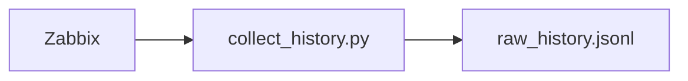

A raw historical observation conceptually contains:

```json
{
  "timestamp": "...",
  "itemid": "...",
  "hostid": "...",
  "canonical_metric": "...",
  "value": 123
}
```

The key idea is:

```text
Metric value
      +
Timestamp
      ↓
Time-series observation
```

A value without time is incomplete for network behavior analysis.

---

## 9. Temporal Behavior

Sampling intervals are part of the data's nature.

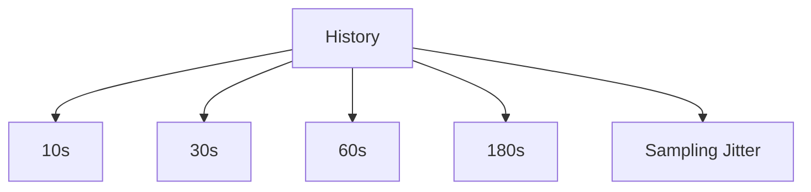

For counter-derived metrics, the transformation therefore depends on actual elapsed time:

```text
Rate
 =
ΔCounter / ΔActualTime
```

The pipeline does not assume that every item has an identical sampling interval.

---

## 10. Counter Semantics

A counter represents cumulative state rather than instantaneous traffic.

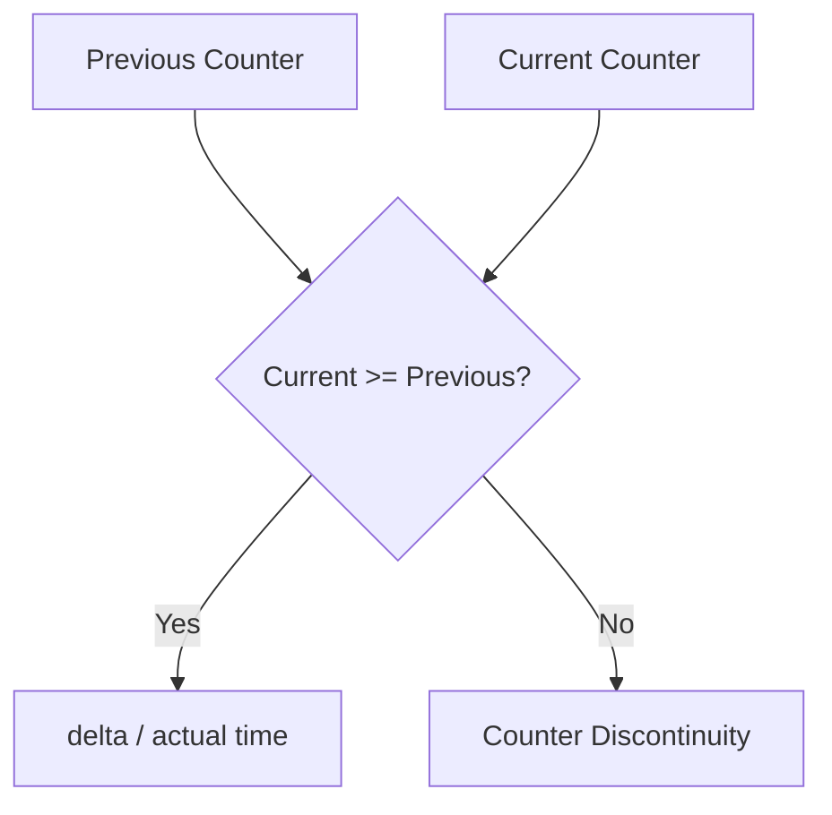

Normal behavior:

```text
100
120
150
180

        ↓

20
30
30
```

Decrease:

```text
180
  ↓
5
```

must not automatically become:

```text
negative traffic
```

Instead it becomes contextual information about a possible counter discontinuity.

---

## 11. Counter Decrease Discovery

The project deliberately investigated counter decreases rather than silently deleting them.

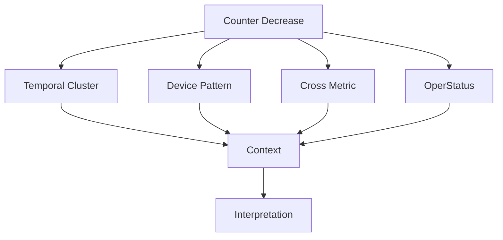

Artifacts:

```text
counter_decrease_audit.json

counter_reset_audit.py
counter_reset_audit.json

counter_reset_correlation_audit.py
counter_reset_correlation_audit.json

counter_reset_temporal_cluster_audit.py
counter_reset_temporal_cluster_audit.json

counter_reset_device_pattern_audit.py
counter_reset_device_pattern_audit.json

counter_reset_cross_metric_audit.py
counter_reset_cross_metric_audit.json

counter_semantics_deep_audit.py
counter_semantics_deep_audit.json

raw_cross_metric_audit.py
raw_cross_metric_audit.json
```

The investigation found a set of known counter-decrease behaviors and established that these events should be represented as **contextual data-quality signals**, not automatically interpreted as incidents.

---

## 12. Counter Transformation

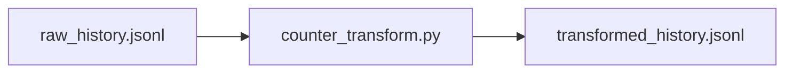

Transformation logic:

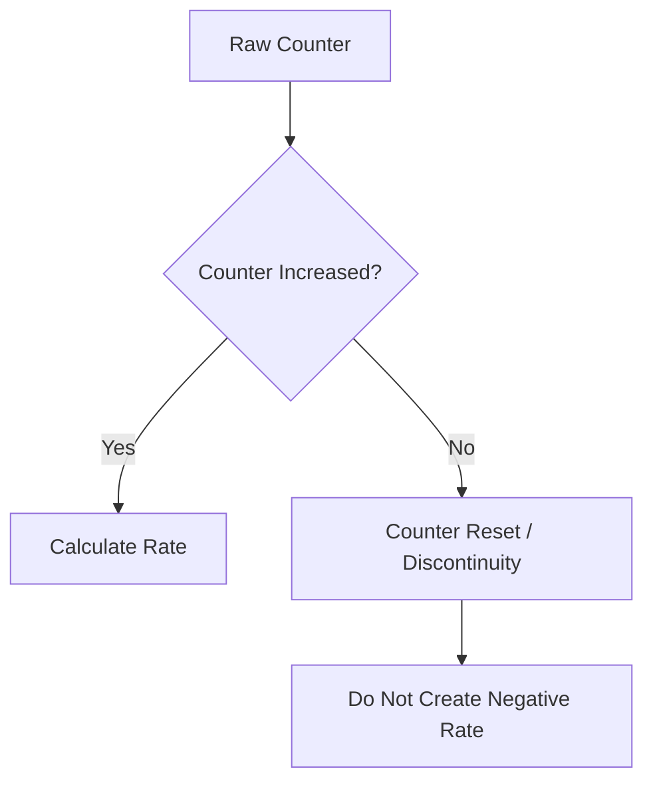

Artifacts:

```text
counter_transform.py
counter_transform_audit.json
transformed_history.jsonl
transformed_history_audit.json
```

The resulting transformed layer becomes the input to feature engineering.

---

## 13. Data Quality

Auditing is a quality layer across the pipeline, not a single final step.

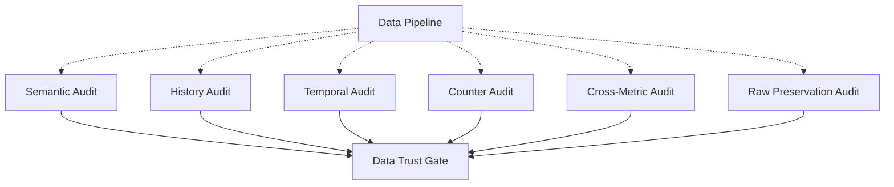

The audit philosophy is:

```text
Not:
    "Make all anomalies disappear"

But:
    "Understand what the data is doing
     and define how the pipeline should handle it"
```

---

## 14. From Metrics to an Interface Vector

The unit of analysis becomes larger than a single item.

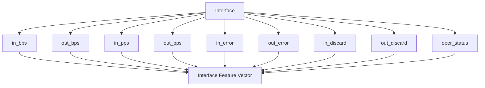

An interface therefore becomes a **multidimensional observation**:

```text
Interface
├── Traffic
├── Packets
├── Errors
├── Discards
└── State
      ↓
Feature Vector
```

---

## 15. Recent Behavior vs Baseline

A single point in time is not enough to describe behavior.

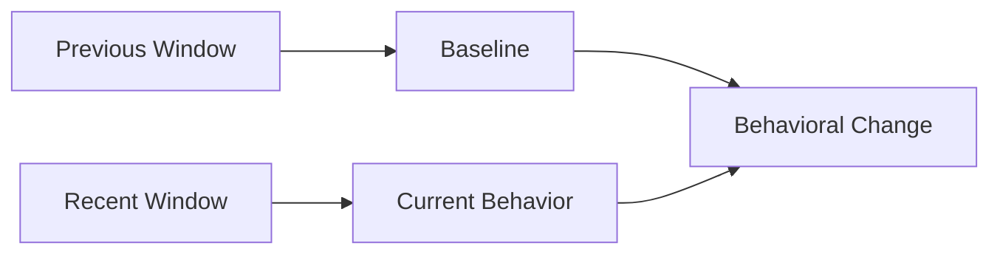

For a five-minute window:

```text
T-10m              T-5m                 T
 |------------------|--------------------|
       Baseline              Recent
```

Behavior is measured as:

```text
recent_mean
    -
baseline_mean
    =
behavior_change
```

Additional representations include:

```text
change
change_pct
recent_to_baseline_ratio
increase_flag
decrease_flag
```

This allows the feature layer to describe patterns such as:

```text
traffic spike
traffic drop
error burst
discard burst
latency change
```

---

## 16. Interface Feature Store

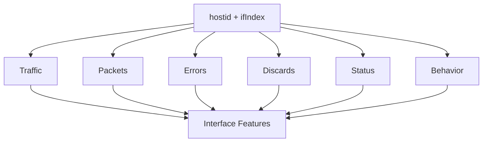

Artifact:

```text
interface_features.jsonl
```

The feature store contains both current behavior and temporal context.

---

## 17. Device Feature Store

Some observations describe the device as a whole rather than a single interface.

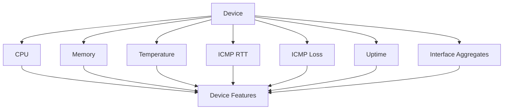

Artifact:

```text
device_features.jsonl
```

This creates two complementary perspectives:

```text
              Network Device
                    │
          ┌─────────┴─────────┐
          ▼                   ▼
    Interface Level      Device Level
       Local              Systemic
       Behavior           Behavior
```

---

## 18. Missing Data

Missing data is treated as information, not automatically converted to zero.

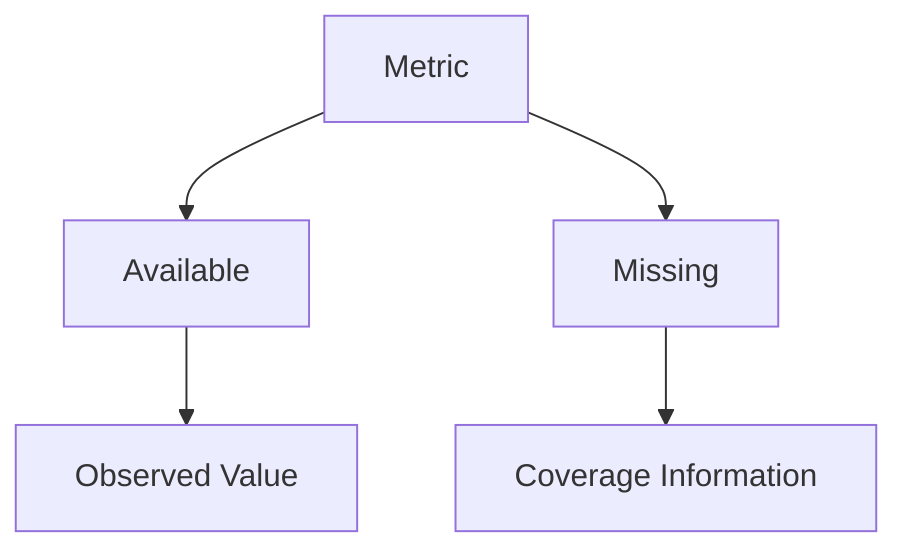

The distinction is:

```text
0
=
metric was observed and its value is zero

null
=
metric was not observed / not available
```

The feature layer therefore keeps coverage indicators such as:

```text
metric_coverage_ratio
baseline_metric_coverage_ratio
```

---

## 19. Warm-up

Temporal features require enough history before they become meaningful.

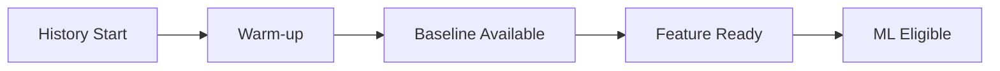

Therefore:

```text
Feature Store
    ≠
Training Matrix
```

Warm-up records can remain in the feature store for observability while being excluded from model training.

---

## 20. Feature Store to ML Dataset

```mermaid
flowchart TD
    F[Feature Store]
    F --> Q[Quality Gate]
    Q --> S[Feature Selection]
    S --> I[Missing Value Handling]
    I --> T[Chronological Split]
    T --> ML[ML Matrix]
```

Artifacts:

```text
ml_dataset_builder.py

ml_dataset/
├── ml_interface_train.csv
├── ml_interface_inference.csv
├── ml_device_train.csv
└── ml_device_inference.csv
```

The ML dataset is therefore a **derived representation**, not the original telemetry itself.

---

## 21. Current Data Flow

```mermaid
flowchart LR
    A[zabbix_inventory.json]
    B[selected_metrics.json]
    C[scope_config.json]
    D[scoped_metrics.json]
    E[semantic_metrics.json]
    F[raw_history.jsonl]
    G[transformed_history.jsonl]
    H[interface_features.jsonl]
    I[device_features.jsonl]
    J[ml_dataset]

    A --> B
    B --> C
    C --> D
    D --> E
    E --> F
    F --> G
    G --> H
    G --> I
    H --> J
    I --> J
```

---

## 22. Artifact Relationship

The repository can be understood as a chain of evidence:

```mermaid
flowchart TD
    A[zabbix_inventory.json]
    B[selected_metrics.json]
    C[scope_config.json]
    D[scoped_metrics.json]
    E[semantic_metrics.json]
    F[raw_history.jsonl]
    G[transformed_history.jsonl]
    H[interface_features.jsonl]
    I[device_features.jsonl]
    J[ml_dataset]

    A --> B
    B --> D
    C --> D
    D --> E
    E --> F
    F --> G
    G --> H
    G --> I
    H --> J
    I --> J
```

Audit artifacts provide validation around these transformations:

```mermaid
flowchart LR
    P[Pipeline]

    P -.-> A[Scope Audit]
    P -.-> B[Semantic Audit]
    P -.-> C[History Audit]
    P -.-> D[Transformation Audit]
    P -.-> E[Counter Audits]
    P -.-> F[Feature Audit]
    P -.-> G[Raw Cross-Metric Audit]
```

---

## 23. Repository Map

The repository can be conceptually grouped into the following areas:

```text
.
├── Discovery
│   ├── zabbix_script.py
│   ├── zabbix_summarize.py
│   └── zabbix_inventory.json
│
├── Scope
│   ├── generate_scope_config.py
│   ├── scope_filter.py
│   ├── scope_config.json
│   ├── selected_metrics.json
│   └── scoped_metrics.json
│
├── Semantic Layer
│   ├── build_semantic_metrics.py
│   ├── semantic_metrics.json
│   ├── audit_semantics.py
│   └── semantic_audit.json
│
├── Historical Layer
│   ├── collect_history.py
│   ├── raw_history.jsonl
│   └── transformed_history.jsonl
│
├── Transformation
│   ├── counter_transform.py
│   └── counter_transform_audit.json
│
├── Auditing
│   ├── audit_*.py
│   ├── counter_*_audit.py
│   ├── *_audit.json
│   └── raw_cross_metric_audit.*
│
├── Feature Engineering
│   ├── feature_engineering.py
│   ├── feature_engineering_audit.json
│   ├── interface_features.jsonl
│   └── device_features.jsonl
│
└── ML Dataset
    ├── ml_dataset_builder.py
    └── ml_dataset/
```

The exact physical folder organization may differ; the structure above describes the **logical role** of the artifacts.

---

## 24. Data Journey

The whole project can be summarized as a journey of discovery:

```mermaid
flowchart TD
    Z[Zabbix]

    Z --> Q1[What devices do we have?]
    Q1 --> Q2[What metrics are relevant?]
    Q2 --> Q3[What does each metric mean?]
    Q3 --> Q4[How does it behave over time?]
    Q4 --> Q5[Can we trust the observation?]
    Q5 --> Q6[Which metrics belong together?]
    Q6 --> Q7[What behavior does the interface/device show?]
    Q7 --> Q8[Can it become an ML feature?]
    Q8 --> ML[ML-ready Dataset]
```

The central idea is:

```text
Inventory
    ↓
Structure
    ↓
Relationship
    ↓
Semantics
    ↓
Temporal Behavior
    ↓
Quality
    ↓
Transformation
    ↓
Feature
    ↓
ML Dataset
```

---

## 25. Current Data Perspective

At the current stage, the Zabbix data pipeline has moved through several layers:

```text
Raw monitoring data
        ↓
Selected monitoring data
        ↓
Scoped monitoring data
        ↓
Semantically classified data
        ↓
Validated historical data
        ↓
Transformed time-series data
        ↓
Interface-level features
        ↓
Device-level features
        ↓
ML training / inference matrices
```

The result is not simply "clean data".

It is:

> **Data whose structure, relationships, semantics, temporal behavior, quality characteristics, and transformations have been explicitly defined.**

---

## 26. Design Principles

### Understand before modeling

```text
Data
 ↓
Understand
 ↓
Validate
 ↓
Transform
 ↓
Engineer
 ↓
Model
```

### Preserve meaning

```text
0    ≠ null
counter ≠ gauge
state  ≠ rate
item   ≠ interface
interface ≠ device
```

### Preserve lineage

Every ML feature should remain traceable back toward:

```text
feature
  ↓
canonical metric
  ↓
item
  ↓
host/interface
  ↓
Zabbix observation
```

### Treat unusual behavior as information

```text
Unexpected counter behavior
        ↓
Investigate
        ↓
Classify
        ↓
Define handling policy
```

---

## 27. Future ML Boundary

The current repository stops at the ML dataset boundary.

```mermaid
flowchart LR
    Z[Zabbix]
    Z --> E[Data Engineering]
    E --> F[Feature Store]
    F --> D[ML Dataset]
    D --> M[Anomaly Detection]
```

The next engineering layer can use multiple anomaly detectors:

```text
ML Dataset
    │
    ├── Isolation Forest
    ├── Extended Isolation Forest
    ├── ECOD
    ├── COPOD
    └── Random Cut Forest
            │
            ▼
        Ensemble Voting
```

That model layer is intentionally kept separate from the data-understanding layer documented here.

---

## 28. Conclusion

This project treats Zabbix SNMP telemetry as a structured data system rather than a collection of isolated monitoring numbers.

The central discovery is:

```text
Host
 ↓
Interface
 ↓
Item
 ↓
Metric
 ↓
History
 ↓
Semantic Meaning
 ↓
Temporal Behavior
 ↓
Transformation
 ↓
Feature
 ↓
ML Dataset
```

The purpose of the engineering pipeline is therefore not merely to "clean Zabbix data", but to make the relationships inside the data explicit enough that the resulting features can be understood, audited, reproduced, and eventually used by machine-learning systems.

> **We do not start by training a model. We start by understanding the data.**
